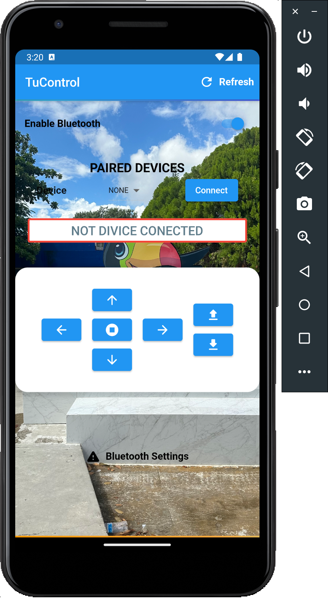

# TuControl

App to establish serial communication with arduino via bluetooth 2.0

send numbers like string

0. stop
1. forward
2. backward
3. right
4. left

--- 

<figure>
    
    <figcaption>TuControl</figcaption>
</figure>

